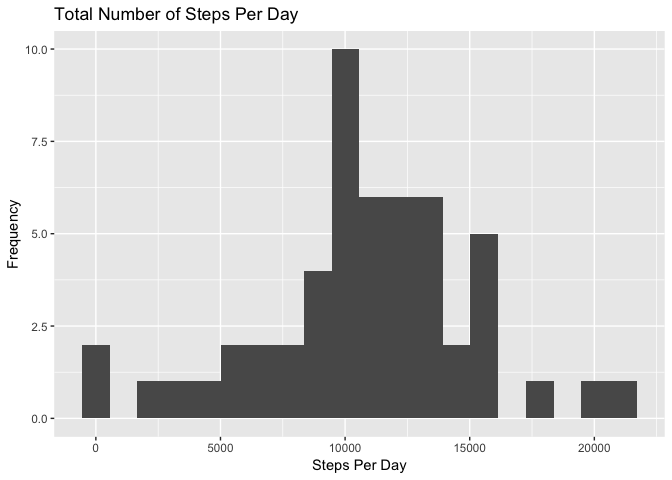
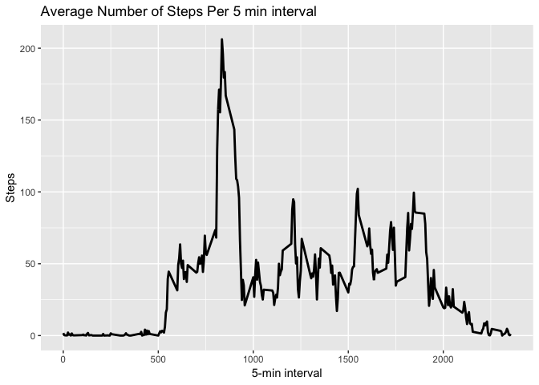
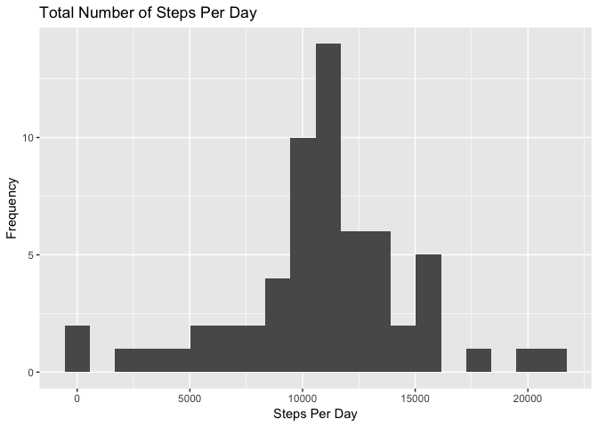
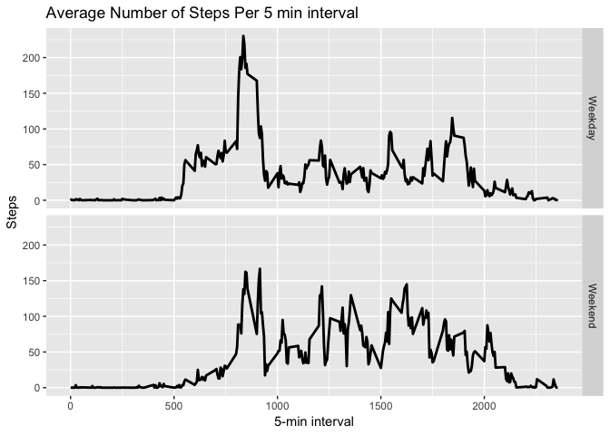

## Loading and preprocessing the data
read the csv file and convert dates format from factor into date.


```r
library(ggplot2)
dataset<-read.csv('./activity.csv')
dataset$date<-as.Date(dataset$date, '%Y-%m-%d')
```


## What is mean total number of steps taken per day?
Aggregate steps per day, produce a histogram for total steps per day


```r
stepsperday<-aggregate(steps~date, dataset, sum, na.rm=F)
ggplot(stepsperday, aes(x=steps))+geom_histogram(bins = 20) + 
  ggtitle("Total Number of Steps Per Day") + xlab("Steps Per Day") + 
  ylab("Frequency")
```

<!-- -->

Calculate the mean and median of total steps per day


```r
meanstep<-mean(stepsperday$steps, na.rm = T)
medianstep<-median(stepsperday$steps, na.rm = T)
print('The mean total steps per day are ')
```

```
## [1] "The mean total steps per day are "
```

```r
print(meanstep)
```

```
## [1] 10766.19
```

```r
print('The median of total steps per day is ')
```

```
## [1] "The median of total steps per day is "
```

```r
print(medianstep)
```

```
## [1] 10765
```

## What is the average daily activity pattern?
Aggregate steps per 5-minute interval and produce a time-series plot


```r
stepsperinterval<-aggregate(steps~interval, dataset, mean, na.rm=F)
ggplot(stepsperinterval, aes(x=interval, y=steps))+geom_line(lwd=1) + 
  ggtitle("Average Number of Steps Per 5 min interval") + 
      xlab("5-min interval") + ylab("Steps")
```

<!-- -->

Find which interval has the maximum average steps during the day


```r
print(stepsperinterval[which.max(stepsperinterval$steps),1])
```

```
## [1] 835
```

## Imputing missing values
Total number of NA observations (steps)


```r
sum(is.na(dataset$steps))
```

```
## [1] 2304
```
!There are no NA values for dates and interval!

Substitute NA values with the average of that particular 5 min interval and
create new dataset


```r
avestepsInterval<-aggregate(steps~interval, dataset, mean, na.rm=T)
newdataset<-dataset
for (i in 1:nrow(newdataset)) {
      if (is.na(newdataset$steps[i])) {
            newdataset$steps[i]<-avestepsInterval[which(
                  avestepsInterval$interval==newdataset$interval[i]),2]
      }
}
```

Aggregate steps per day, produce a histogram for total steps per day with new
dataset


```r
stepsperday<-aggregate(steps~date, newdataset, sum, na.rm=F)
ggplot(stepsperday, aes(x=steps))+geom_histogram(bins = 20) + 
  ggtitle("Total Number of Steps Per Day") + xlab("Steps Per Day") + 
  ylab("Frequency")
```

<!-- -->

Calculate the mean and median of total steps per day with new dataset


```r
meanstep<-mean(stepsperday$steps)
medianstep<-median(stepsperday$steps)
print('With the new dataset, the mean total steps per day are ')
```

```
## [1] "With the new dataset, the mean total steps per day are "
```

```r
print(meanstep)
```

```
## [1] 10766.19
```

```r
print('With the new dataset, the median of total steps per day is ')
```

```
## [1] "With the new dataset, the median of total steps per day is "
```

```r
print(medianstep)
```

```
## [1] 10766.19
```

The new histogram is equal to the one derived from database with NAs; the mean 
remained the same, but the median changed slightly and became equal to the
mean.

## Are there differences in activity patterns between weekdays and weekends?
Create a new variable in the new dataset (with no NA) according to weekdays


```r
newdataset$day<-weekdays(newdataset$date, abbreviate = T)
newdataset$day<-ifelse((newdataset$day=='Sat')|(newdataset$day=='Sun'),
                       'Weekend','Weekday')
```

Aggregate steps per 5-minute interval and whether on weekdays or weekend and
produce a time-series plot


```r
stepsperinterval<-aggregate(steps~interval+day, newdataset, mean)
ggplot(stepsperinterval, aes(x=interval, y=steps))+geom_line(lwd=1) + 
      facet_grid(day~.) +
      ggtitle("Average Number of Steps Per 5 min interval") + 
      xlab("5-min interval") + ylab("Steps")
```

<!-- -->
